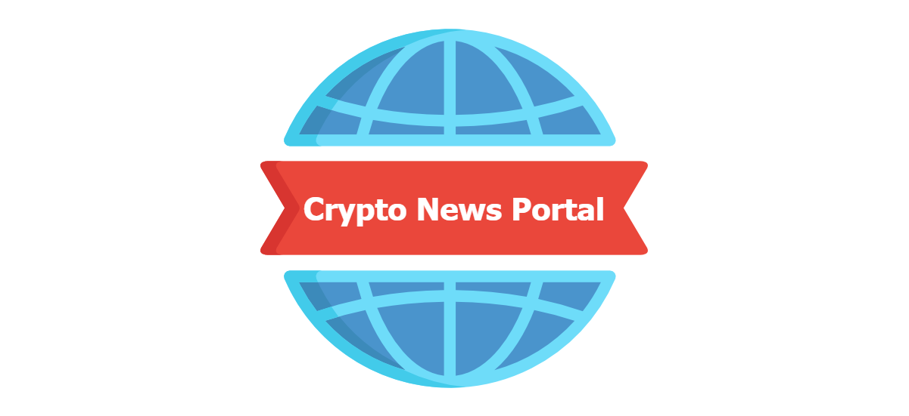

# CryptoNewsPortal

News Portal, that running on Polygon chain, where everyone who has some news can share it by connecting their wallet to the portal (using Metamask or domain name from Unstoppable Domains) and confirm the transaction.


----------

## Presentation


- **Link to video presentation:** [https://www.youtube.com/watch?v=gqsJ5FlbiXs](https://www.youtube.com/watch?v=gqsJ5FlbiXs)
- **Try app live:** [https://cryptonewsportal.netlify.app](https://cryptonewsportal.netlify.app)

----------

## Features:

- Responsive design;
- Dark/Light Mode;
- Ability to see all the news posted (with the date, the address wallet of the author and the domain name (if the author was logged in using Unstoppable Domains) );
- Ability to add news on the portal;
- Possibility to upload multiple photos (using the button or drag and drop) in the article;
- Only the contract owner can delete the news;
- Integration of **Login with Unstoppable Domains**


----------

## Demo screens:

<table>
  <tr>
    <td></td>
    <td></td>
  </tr>
  <tr>
    <td></td>
  </tr>
</table>


----------

## Deployment

Smart Contract is deployed to [Polygon Mainnet](https://polygonscan.com). You can find the code in the `contracts` folder.

App frontend is deployed on Netlify and you must have Metamask installed to interact with smart contract.

### Technology Stack and Tools

* [Login with Unstoppable](https://unstoppabledomains.com)
* [Moralis](https://moralis.io/) - IPFS API
* [Metamask Wallet](https://metamask.io/)
* [Web3js](https://web3js.readthedocs.io/en/v1.3.0/) - library interact with ethereum nodes
* [Solidity](https://docs.soliditylang.org/en/v0.7.4/) - ethereum smart contract language
* [React](https://reactjs.org/) - front end framework
* [JavaScript](https://www.javascript.com/) - logic front end and testing smart contracts
* [Chakra ui](https://chakra-ui.com/) - UI component library

## Installation & running application

First, clone the repository
```
git clone https://github.com/spectralchord/CryptoNewsPortal-unstoppabledomains.git
```

Next, navigate to the cloned directory and install the necessary Node.js modules 
```
cd CryptoNewsPortal-unstoppabledomains
npm install

or

yarn install
```

Configure environment variables in `.env` file. You can find variables in `env.txt` file.
```
REACT_APP_MORALIS_KEY -> get an API key by creating a free account [https://moralis.io]
REACT_APP_CONTRACT_ADDRESS -> address of the deployed smart contract
REACT_APP_CONTRACT_OWNER -> address of the contract creator
REACT_APP_IPFS_GATEWAY -> base URL of the IPFS gateway, like "https://ipfs.io/ipfs/"

and others...
```

Finally, run the app,
```
npm run start

or

yarn start
```

You need to have Metamask Wallet. Connect to the app using your wallet. When connected, your address will show on the top navigation bar.

------------

## Todos

- [ ] Adding categories and tags for news, as well as filtering news
- [ ] Add a more powerful text editor
- [ ] Add the ability to rate news
- [ ] Adding the ability to leave comments on news
- [ ] Adding a dashboard with functions for the admin
